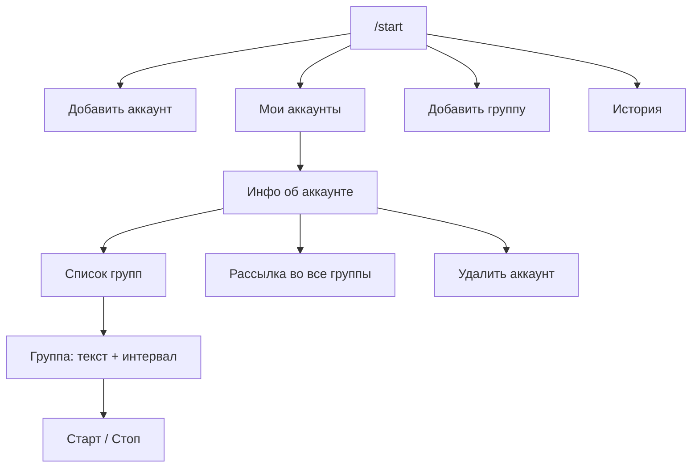

# TgBlaster

[](https://github.com/zerox9dev/TgBlaster/actions/workflows/ci.yml)

[](LICENSE)

Телеграм-бот для рассылки сообщений по группам с твоих аккаунтов. Управляешь всем через чат с ботом: добавляешь аккаунты, цепляешь группы, задаёшь текст и интервал — дальше он сам шлёт по расписанию.

Сделано на [Telethon](https://docs.telethon.dev/). Хранилище — обычный SQLite, никакой инфраструктуры поднимать не надо.

> ⚠️ Массовые рассылки с юзер-аккаунтов нарушают ToS Telegram и легко ловят бан номера. Используй на свой страх и риск и желательно на аккаунтах, которые не жалко.

## Что умеет

- Несколько аккаунтов в одном боте — авторизация прямо в чате (телефон → код → 2FA, если есть).
- Группы можно добавлять по username вручную или подтянуть сразу все, где состоит аккаунт.
- Рассылка в одну группу или сразу во все — с фиксированным интервалом или случайным в заданном диапазоне.
- Можно прикреплять фото.
- Старт/стоп по каждой группе отдельно, история последних отправок.
- Доступ только для админов из белого списка.

## Как устроено меню



## Запуск

Нужны Python 3.10+, `API_ID`/`API_HASH` с [my.telegram.org](https://my.telegram.org) и токен бота от [@BotFather](https://t.me/BotFather).

```bash
pip install -r requirements.txt
cp .env.example .env   # и заполни значения
python main.py
```

`.env`:

```dotenv
API_ID=12345678
API_HASH=...
BOT_TOKEN=...
ADMIN_ID_LIST=11111111,22222222   # твои Telegram ID, кому можно пользоваться ботом
```

## Как пользоваться

1. `/start` → **Добавить аккаунт**. Вводишь номер в международном формате (например `+12025550123`), код из Telegram, при необходимости — пароль 2FA.
2. Цепляешь группы: либо **Добавить группу** по `@username`, либо в карточке аккаунта — **добавить все группы аккаунта**.
3. Открываешь группу (или весь аккаунт), задаёшь текст и интервал, жмёшь старт.
4. Остановить можно по конкретной группе или сразу всю рассылку аккаунта. В **Истории** — последние отправки: куда, когда, что и с какого аккаунта.

Сессии аккаунтов лежат в `sessions.db`, логи — в `logs/`. Файл с сессиями фактически даёт полный доступ к аккаунтам, так что не светите его и держите в `.gitignore`.

## Запуск в Docker

```bash
cp .env.example .env   # заполни
docker compose up -d
```

`sessions.db`, сессия бота и логи вынесены в volume'ы, так что переживают пересоздание контейнера.

## Дальше

- [CONTRIBUTING.md](CONTRIBUTING.md) — как поднять локально и слать PR
- [SECURITY.md](SECURITY.md) — как репортить уязвимости (и почему `sessions.db` нельзя светить)
- [CHANGELOG.md](CHANGELOG.md) — что менялось

Лицензия — [MIT](LICENSE).
